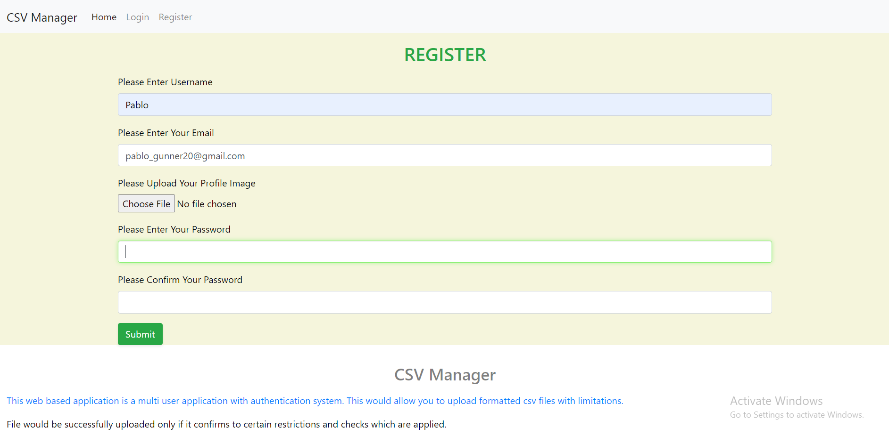
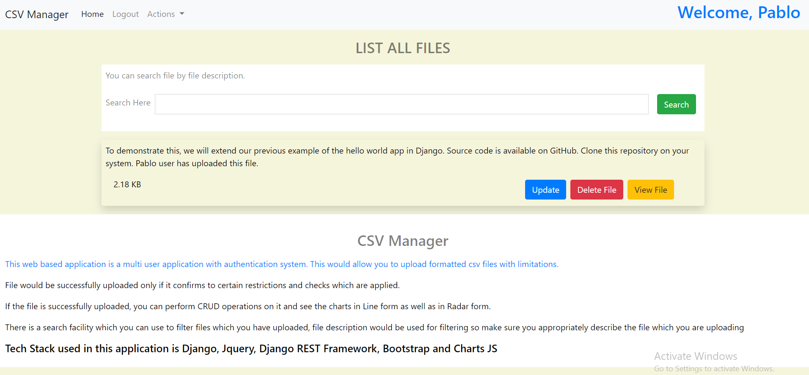

# A Multi User Web Application to Manage your CSV files through user friendly charts and graphs.

This is a multi user application which implements custom user model by extending the AbstractBaseUser class in Django.
After the user successfully logs in the system, he/she can upload documents in CSV format only. Before the document is
uploaded few checks are applied using pandas python library.

CRUD operations can be performed on files, file size would be displayed for each file along with file description.
There is search filtering option available based on file description.

## Getting Started

* The app is build using Django 3.0.2, many of the dependencies are optional under the requirements.txt file because
I did not create a separate virtual environment while working with this project. But, you should make sure you do that,
just a good practice :D

* If you are unsure, just install all the dependencies from requirements file, aside from Django, this application uses
pandas and REST framework libraries for the most part.

* MySQL is used as the database for the back-end. You can off course configure your own database in settings.py file.
Make sure you do that, you can integrate sqlite3 (very easily, comes by default with Django apps), PostGreSQL or
even MongoDB. Make sure you have appropriate libraries installed as connectors.

* Run the migrations after you are done with database and template settings. Hit the command
'python manage.py runserver' after activating virtual environment.

* The Application should now be running on your system, You can start uploading CSV files and view data
in the form of attractive Line and Radar charts.

* Pagination is provided for datasets containing large number of entries.

* Please find the screenshots of the application attached below.

## Built With

* [Django](https://www.djangoproject.com/)
* [JQuery](https://jquery.com/)
* [Bootstrap 4](https://getbootstrap.com/)
* [HTML + CSS](https://www.w3schools.com/html/html_css.asp)

## Authors

* **Amit Prafulla (APFirebolt)** - (http://amitprafull.com/)

## License

This project is licensed under the MIT License - see the [LICENSE.md](LICENSE.md) file for details

## Screenshots

* Please find some of the screenshots of the application. Below is the screenshot which shows the user login page.

* User Registration Page

* Registration page with errors illustrating the validators have been applied.

* Dashboard Page, user would be directed to the dashboard page after successful login.

* Files Page which shows list of files with their sizes, here you can perform CRUD operations on files.

* First image of the charts page where charts are implemented using Jquery, AJAX and charts JS library. Pagination
has been implemented using Bootstrap and Jquery.

* Another screenshot of the charts page. This one shows Radar chart.

* One more charts page screenshot, you can also view all the data inside the CSV in container on the webpage.

* Upload File page, here you can only upload CSV files. There are other custom checks applied. One of these applied
checks is shown in the screenshot below. Deep inspection of CSV data is performed before upload using Pandas library.

